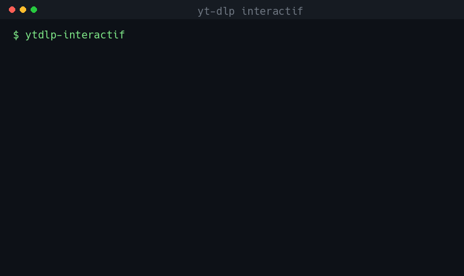

# yt-dlp interactif

[](https://github.com/daraook/yt-dlp-interactif/actions/workflows/ci.yml)
[](LICENSE)


**Rendre `yt-dlp` utilisable par tout le monde.**

`yt-dlp` est un téléchargeur vidéo/audio extrêmement puissant — mais avec ~255 options
en ligne de commande, il est intimidant pour qui n'est pas à l'aise avec le terminal.
Cet outil le transforme en **assistant interactif** : au lieu d'un terminal vide qui
attend une commande cryptique, il se présente, propose des choix clairs, pose les bonnes
questions au bon moment, et exécute à ta place.



*Menus guidés avec descriptions, réglages par défaut intelligents, et la commande
`yt-dlp` expliquée à la demande.*

> Premier d'une série d'outils visant à donner une interface interactive à des programmes
> en ligne de commande. La méthode employée est documentée dans
> [`docs/GUIDE-METHODOLOGIE.md`](docs/GUIDE-METHODOLOGIE.md) pour être réappliquée.

---

## Fonctionnalités

L'outil couvre les usages réels de yt-dlp, regroupés par intention :

**Télécharger** — Vidéo (H.264/AAC compatible par défaut, lit partout) · Audio (MP3, m4a,
opus, flac, wav) · Choisir la qualité (menu des formats réellement disponibles, avec tailles) ·
Playlist / chaîne (rangée par dossier, numérotée, **reprise anti-doublon**) · Fichier de liens (lot).

**Transformer** — Découper un extrait (`HH:MM-HH:MM`, coupe précise) · Convertir
(remux sans perte ou réencodage) · SponsorBlock (retirer/marquer sponsors, intros, outros…) ·
Sous-titres (avec ou sans la vidéo, par langue, incrustables) · Miniature & métadonnées.

**Cas particuliers** — Débloquer (cookies du navigateur pour le contenu privé/membre/âge,
+ contournement géographique) · Live / première (depuis le début, ou en attente) ·
Vitesse / réseau (bride de débit, parallélisme).

**Outils** — Chercher (par mots-clés : liste vidéos **et** playlists, puis télécharge) ·
Inspecter (titre, durée, qualités, sous-titres — sans rien télécharger) · Mettre à jour yt-dlp.

**Sur mesure** — 🧩 **Personnalisé** : empile n'importe quelle combinaison en un seul
téléchargement (ex. *playlist entière + audio seul + retirer les sponsors + sous-titres FR*).

À chaque étape, un choix **« voir la commande »** affiche la commande `yt-dlp` exécutée
et **explique chaque option** — pour apprendre en faisant (masqué par défaut).

## Multi-plateforme

L'outil ne se limite pas à YouTube : les URLs sont passées telles quelles à yt-dlp, qui
gère **~1 800 sites** (Vimeo, Dailymotion, TikTok, SoundCloud, X/Twitter, Facebook, Twitch…),
plus les fichiers média directs via l'extracteur générique. Seul **SponsorBlock** est
spécifique à YouTube.

## Prérequis

| Dépendance | Rôle | Obligatoire |
|-----------|------|:-----------:|
| **yt-dlp** | moteur de téléchargement | ✅ (vérifié au lancement) |
| **ffmpeg** | audio, fusion vidéo+audio, incrustation, conversion | ✅ (vérifié au lancement) |
| **Python ≥ 3.11** | exécuter l'interface | ✅ |
| **Deno** | fiabilise l'extraction YouTube (voir plus bas) | ⚪ facultatif |

## Installation

**Étape commune — installer yt-dlp et ffmpeg** (requis, quelle que soit l'option) :

| Système | Commande |
|--------|----------|
| Debian / Ubuntu / Kali | `sudo apt install yt-dlp ffmpeg` |
| macOS (Homebrew) | `brew install yt-dlp ffmpeg` |
| Windows (winget) | `winget install yt-dlp.yt-dlp ffmpeg` |

> Si le `yt-dlp` de ta distribution est ancien : `pip install -U yt-dlp` (ou l'option
> « Mettre à jour yt-dlp » dans l'outil).

Ensuite, choisis **une** des deux options ci-dessous.

### Option A — Simple (recommandée) · via pipx

`pipx` installe l'outil de façon isolée et le rend disponible partout, sur
**Linux, macOS et Windows**. Il gère l'environnement pour toi.

**1. Installer pipx** (une seule fois) :

| Système | Commande |
|--------|----------|
| Debian / Ubuntu / Kali | `sudo apt install pipx` |
| macOS (Homebrew) | `brew install pipx` |
| Windows | `py -m pip install --user pipx` puis `py -m pipx ensurepath` |

**2. Installer l'outil — une commande :**

```bash
pipx install git+https://github.com/daraook/yt-dlp-interactif.git
```

**3. Lancer — une commande (depuis n'importe où) :**

```bash
ytdlp-interactif
```

> Pour mettre à jour plus tard : `pipx upgrade ytdlp-interactif`.
> Pour désinstaller : `pipx uninstall ytdlp-interactif`.

### Option B — Manuelle · via un environnement virtuel

Pour celles et ceux qui préfèrent tout maîtriser, ou pour **développer** (voir aussi
[`CONTRIBUTING.md`](CONTRIBUTING.md)) :

```bash
git clone https://github.com/daraook/yt-dlp-interactif.git
cd yt-dlp-interactif
python3 -m venv .venv
.venv/bin/pip install -e .
```

Lancement : `.venv/bin/ytdlp-interactif`

## Utilisation

Lance la commande selon ton installation :

- Installé avec **pipx** (Option A) : `ytdlp-interactif`
- Installé avec **venv** (Option B) : `.venv/bin/ytdlp-interactif`

Navigue avec ↑↓, valide avec Entrée. Les fichiers atterrissent dans
`~/Téléchargements/yt-dlp-interactif/` (dossier Téléchargements détecté selon l'OS —
Linux/Windows/macOS), dans un sous-dossier daté par session. Les playlists vont dans un
dossier stable `playlists/` pour que la reprise anti-doublon persiste entre deux lancements.

## À propos de Deno (facultatif)

YouTube protège l'accès à ses formats par un « défi JavaScript » (nsig). Pour le résoudre,
yt-dlp a besoin d'un **runtime JavaScript**.

- **Sans runtime JS** : yt-dlp se rabat sur des clients alternatifs. Ça fonctionne le plus
  souvent, mais avec un avertissement, des formats parfois manquants, et davantage de risques
  d'erreurs transitoires (« Video unavailable », throttling) sur certaines vidéos.
- **Avec Deno** (un runtime JS en un seul binaire) : yt-dlp peut résoudre le défi et obtenir
  l'accès complet et fiable aux formats YouTube.

Deno est **externe et optionnel** : il n'est pas embarqué, n'alourdit pas l'outil, et
n'affecte **que** YouTube (aucun effet sur les autres sites). L'outil fonctionne sans ;
s'il est absent, une astuce non bloquante propose de l'installer :

```bash
curl -fsSL https://deno.land/install.sh | sh
```

Pour que yt-dlp exploite pleinement Deno sur les défis récents, ajoute une fois pour toutes
`--remote-components ejs:github` à ta configuration yt-dlp (voir le
[wiki EJS de yt-dlp](https://github.com/yt-dlp/yt-dlp/wiki/EJS)).

## Développement

```bash
.venv/bin/pip install -e ".[dev]"
.venv/bin/python -m pytest -q      # tests unitaires (purs, hors réseau)
.venv/bin/ruff check src tests     # lint
```

### Architecture

```
src/ytdlp_interactif/
├── core/          # noyau, indépendant de toute interface
│   ├── command_builder.py   choix -> liste d'arguments yt-dlp (fonctions pures)
│   ├── runner.py            exécute yt-dlp, transforme la sortie en flux d'événements
│   ├── progress.py          parse une ligne de sortie -> progression
│   ├── probe.py             inspecte formats / infos (yt-dlp -J)
│   ├── search.py            recherche (natif yt-dlp)
│   ├── paths.py             dossiers cross-platform (Téléchargements, session)
│   └── environment.py       vérifie les dépendances
├── intents/       # une intention = un assemblage de choix (plan pur + exécution)
└── ui/            # interface questionary : ne fait que présenter (aucune logique yt-dlp)
```

Le noyau ne connaît pas l'interface : on peut lui brancher une autre présentation
(une interface TUI type Textual est envisagée) sans y toucher. La démarche complète
est décrite dans [`docs/GUIDE-METHODOLOGIE.md`](docs/GUIDE-METHODOLOGIE.md).

### Documentation de référence

- [`docs/GUIDE-METHODOLOGIE.md`](docs/GUIDE-METHODOLOGIE.md) — comment donner une interface
  interactive à n'importe quel outil en ligne de commande (méthode réutilisable).
- [`docs/reference/cartographie-yt-dlp.md`](docs/reference/cartographie-yt-dlp.md) —
  cartographie complète de yt-dlp (17 groupes, 255 options) et couche « intentions ».
- [`docs/spec-extraire-audio.md`](docs/spec-extraire-audio.md) — exemple de spécification
  comportementale (première intention).

## Signaler un problème & contribuer

**Utilisateurs** — si quelque chose ne fonctionne pas comme prévu (un site qui échoue,
un message peu clair, un comportement inattendu), n'hésite pas à **ouvrir un ticket** dans
l'onglet [Issues](https://github.com/daraook/yt-dlp-interactif/issues). Décris ce que tu
faisais, ce que tu attendais et ce qui s'est passé — même un rapport court aide.

**Développeurs** — les contributions sont les bienvenues : nouvelle intention, prise en
charge d'un cas, correction, amélioration de l'interface ou de la doc. Ouvre une *issue*
pour en discuter, puis une *pull request*. La marche à suivre (installation dev, tests,
ajout d'une intention) est détaillée dans [`CONTRIBUTING.md`](CONTRIBUTING.md).

Toute idée d'amélioration ou d'ajout est aussi la bienvenue — propose-la en *issue*.

## Feuille de route

- Interface TUI riche (Textual) en alternative à l'actuelle, sur le même noyau.
- Recherche multi-sites (au-delà de YouTube).
- Généralisation de l'approche à d'autres outils en ligne de commande.

## Usage responsable

Cet outil ne fait que piloter yt-dlp — c'est à toi de l'utiliser dans le respect de la loi.
Les conditions d'utilisation de certaines plateformes (dont YouTube) limitent ou interdisent
le téléchargement, et la plupart des contenus sont protégés par le **droit d'auteur**.
Ne télécharge que ce que tu as le droit de récupérer — ton propre contenu, des œuvres libres
de droits, ou avec l'autorisation de l'ayant droit — et réserve les fichiers à un usage
personnel. Tu restes seul responsable de ton utilisation.

## Licence

MIT — voir [`LICENSE`](LICENSE).
